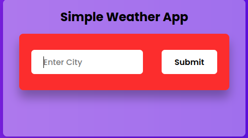
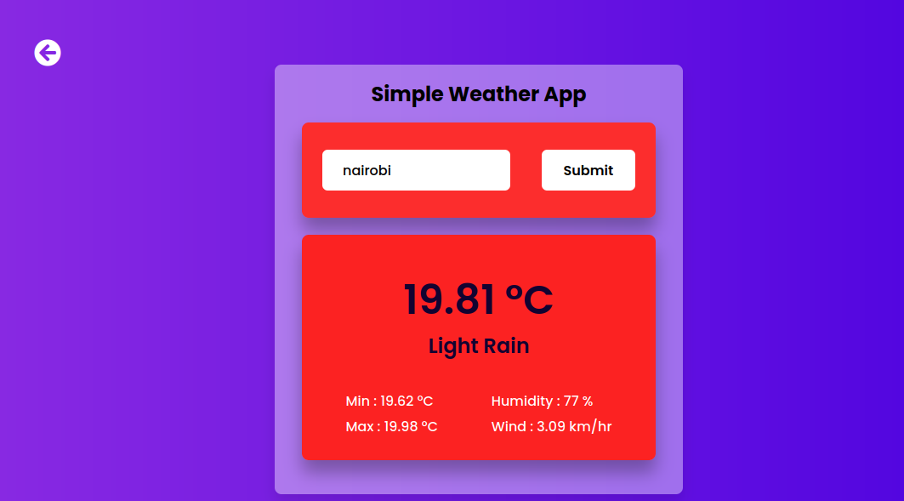
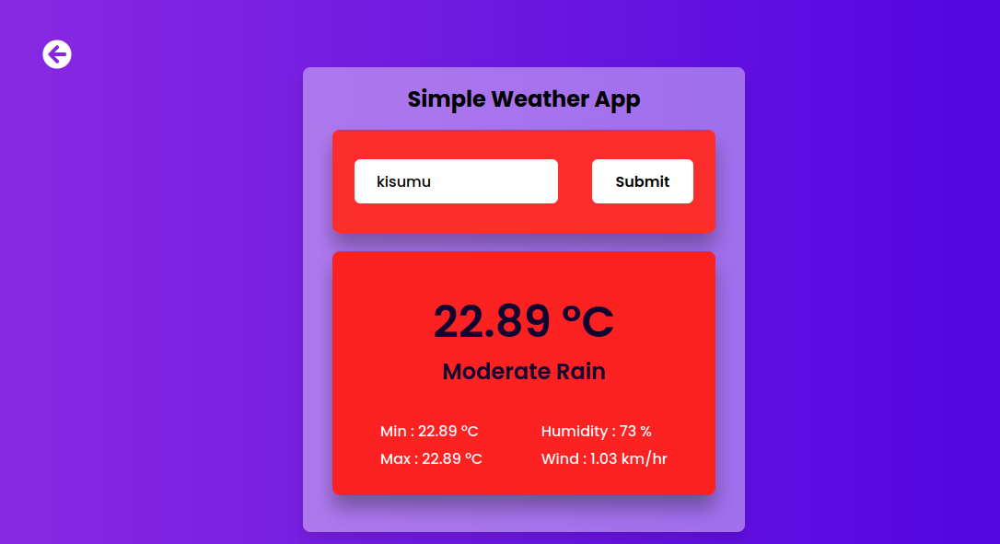

# Weather Website
# Overview
- This repository hosts a dynamic and visually appealing weather website developed using HTML, CSS, and JavaScript. The website provides users with real-time weather information, forecasts, and interactive features to enhance their weather browsing experience. 

# Features
- Current Weather Display: The website prominently showcases the current weather conditions for a user's location or a specified location, including temperature, humidity, wind speed, and weather icon.
- Forecast Information: Users can access detailed weather forecasts for the upcoming days, including temperature trends, precipitation chances, and sunrise/sunset times.
- Location Detection: The website utilizes geolocation services to automatically detect the user's current location and provide relevant weather data. Users can also manually search for weather information for specific locations.
<!-- Interactive Maps: Users can view interactive maps displaying weather patterns, such as radar images for precipitation, cloud cover, and temperature gradients.
Customization Options: The website offers customization options for users to adjust settings such as temperature units (Celsius/Fahrenheit) and preferred language. -->
- Responsive Design: The website is designed to be responsive, ensuring optimal viewing and functionality across various devices and screen sizes.
- Accessibility Features: Accessibility considerations are implemented to ensure that users with disabilities can access and interact with the website effectively.
# Technologies Used
- HTML: The structure and layout of the website are defined using HTML, ensuring semantic markup and accessibility.
- CSS: Cascading Style Sheets are employed for styling and visual presentation, including layout design, typography, and color schemes.
- JavaScript: Client-side scripting is implemented using JavaScript to add interactivity, handle user events, and fetch weather data from APIs.
- Weather APIs: External weather APIs are utilized to fetch real-time weather data and forecasts, ensuring accuracy and reliability.
<!-- Geolocation Services: The website leverages browser geolocation services to determine the user's current location and provide relevant weather information. -->
# Installation and Usage
To run the weather website locally, follow these steps:

- Clone the repository to your local machine.
- Open the index.html file in a web browser to view the website.
- Explore the various features and functionalities of the website, including current weather display, forecasts, and remote weather search.

# Preview

